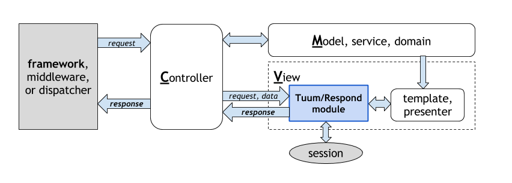

Document Contents
=========

`Tuum/Respond` is a __view module__ as in MVC2 pattern 
as shown in the figure below. 
The module is designed to work with various PSR-7 based 
micro-frameworks, such as [Slim 3 framework](http://www.slimframework.com/). 



As the name suggests, this module helps to compose a 
respond object for views (html pages), error pages, and 
redirects. 

```php
$app->add('/',
    function (ServerRequestInterface $request, ResponseInterface $response) use ($responder) {
        return $responder
            ->view($request, $response)
            ->render('index');
    });
```

Furthermore, Tuum/Respond helps 
to implement Post-Redirect-Get pattern, a technique often used 
in a __traditional web site__ (html rendered at server).

### License

*	MIT license

### PSR

*   PSR-1, PSR-2, PSR-4, and PSR-7.


### Installation

To install `Tuum/Respond`, use the composer. 

```sh
$ composer require "tuum/respond:^3.0"
```
Demo
----

To see `Tuum/Respond` working in a sample site, use git and PHP's internal server at public folder as;

```sh
$ git clone https://github.com/TuumPHP/Respond
$ cd Respond
$ git checkout 3.x-dev
$ composer install
$ cd public
$ php -S localhost:8888 index.php
```

and access ```localhost:8888``` by your local browser. 
The sample site uses external bootstrap css and javascript. 


Getting Started
--------

#### [Sample Codes](samples)

* Simple Code
* Post-Redirect-Get Pattern
* Using Presenter Callable

#### [Directory Structure](structure)

* Template Files
* Building `$responder`

Details
------

#### [Template and Helpers](templates)

* Data Helper
* InputData and InputError Helpers
* Message Helper
* Other Features

#### [Responders](responders)

* View, Error, and Redirect
* Other Objects

#### [Services](services)

* ViewerInterface
* PresenterInterface
* ErrorViewInterface
* SessionStorageInterface
* Helper Classes